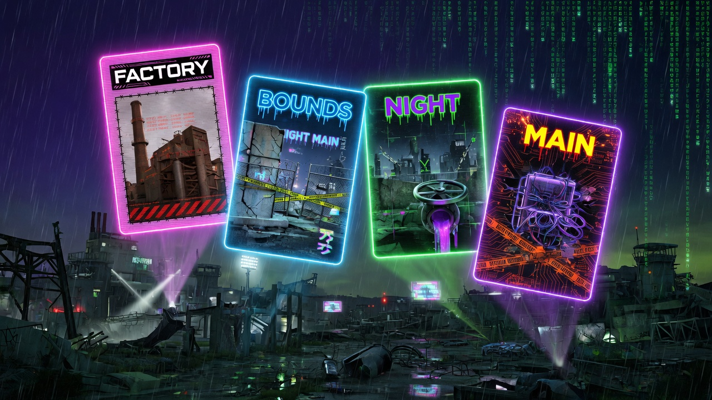
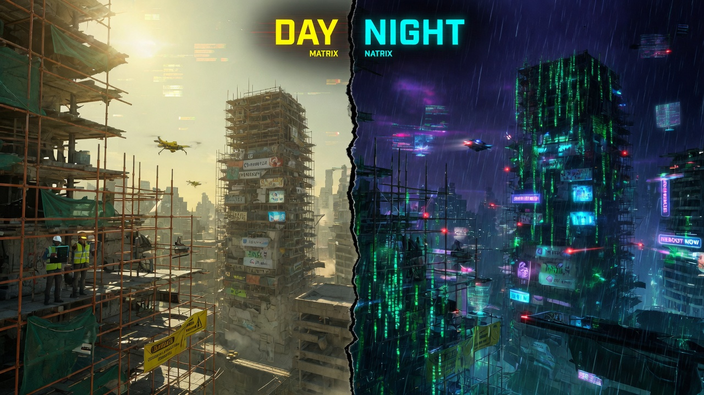
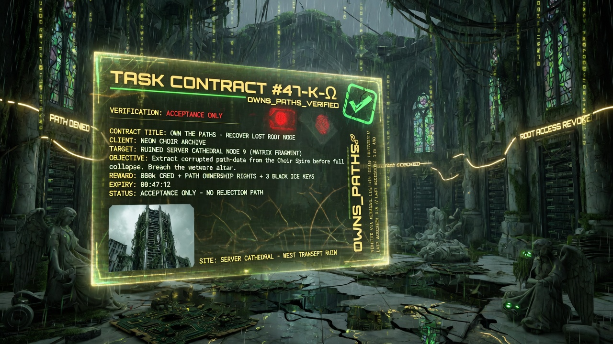
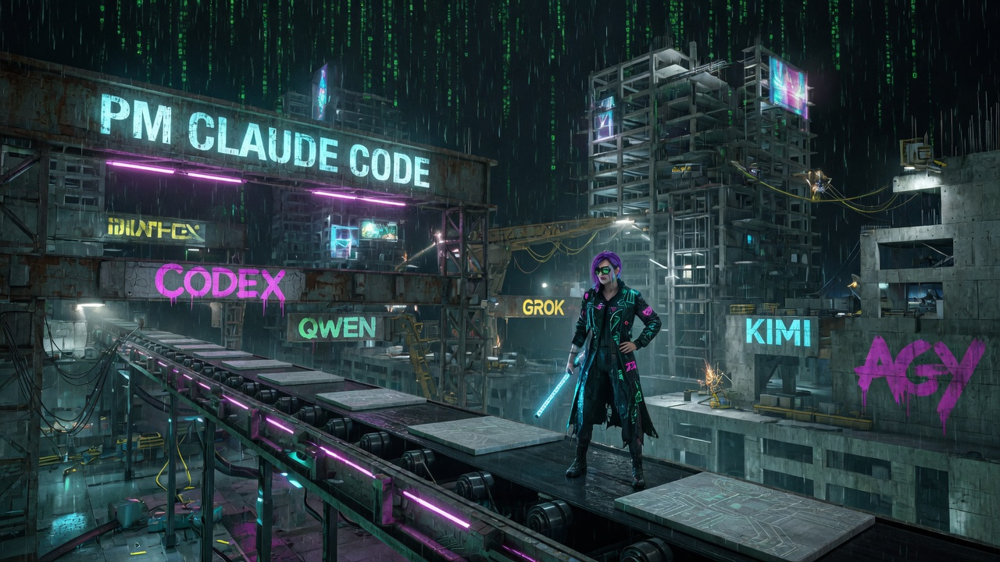

<div align="center">


<br/>

# Claude Lane Stack

### A small AI coding factory for one person

**One human. One AI project manager. Real CLI coding agents on a durable conveyor.**  
Talk to Claude Code — it runs Codex / Qwen / Grok / Kimi / AGY, checks work, **merges to `main`**, reviews at night.

<p>
  <a href="https://github.com/VKirill/claude-lane-stack/releases/tag/v1.27.0"></a>
  <a href="LICENSE"></a>
  <a href="https://code.claude.com/docs"></a>
  <a href="https://github.com/openai/codex"></a>
  <a href="https://t.me/pomogay_marketing"></a>
</p>

<p>
  <a href="README.md"><strong>🇷🇺 Русский</strong></a>
  &nbsp;·&nbsp;
  <a href="docs/BEGINNER.md"><strong>🐣 Beginner guide</strong></a>
  &nbsp;·&nbsp;
  <a href="CHANGELOG.md"><strong>Changelog</strong></a>
  &nbsp;·&nbsp;
  <a href="https://github.com/VKirill/claude-lane-stack/stargazers"><strong>★ Star</strong></a>
</p>

</div>

---

<br/>

<div align="center">

</div>

<br/>

| | | | |
|:--:|:--:|:--:|:--:|
| **🏭 Factory, not five chats** | **🛡️ Owned paths** | **🌙 Night review** | **📦 Auto-merge to main** |
| One PM holds context | Writers stay in their lane | Independent Codex Sol rail | You never merge by hand |

| | | | |
|:--:|:--:|:--:|:--:|
| **🧠 Memory** | **📚 Living docs** | **🎨 Design** | **ℹ️ First hour** |
| Opt-in fact corpus | `docs/` from git, not essays | `docs/DESIGN.md` | `/info` · `/app-architect` |

---

## ✨ Why this exists

Working with AI coding tools usually means: five windows, copy-paste, midnight merges, and zero review discipline.

**Claude Lane Stack turns that into a conveyor** — plain **files + git**, no mandatory cloud DB.

| 😩 Typical AI coding | ✨ Lane Stack |
|----------------------|----------------|
| Re-explain context every chat | **One PM** holds the plan |
| Models overwrite each other | **`owns_paths`** on every task |
| Nobody reviews the AI | **Typed night shift** (review → fix → re-review) |
| You merge branches | **PM merges `main`** after checks |
| “What were we doing?” | **`resume-project`** + **memory** (facts, not chat) |
| Docs rot after the sprint | **Night Luna** refreshes every stale `docs/` page |
| Jobs die at ~2 min Bash | **Detached processes** (survive chat close) |

> [!TIP]
> New here? Start with the **[Beginner guide](docs/BEGINNER.md)** — zero jargon, factory metaphors.

---

## 🔌 CLI agents we plug into

<div align="center">

</div>

<br/>

This is **not** “one model does everything.”  
The stack is a **control plane** that runs **real CLI coding agents** as durable processes.

| CLI | Required? | Role |
|-----|-----------|------|
| **[Claude Code](https://code.claude.com/docs)** | **Yes** | PM (`dev-orchestrator`), watchers, chat with you |
| **[OpenAI Codex CLI](https://github.com/openai/codex)** | Optional | Day writer · **night Sol review** · onboard · **docs (Luna)** · emergency |
| **Qwen Code** | Optional | Daytime durable **writer** |
| **Grok** (xAI CLI) | Optional | Daytime durable **writer** |
| **Kimi** CLI | Optional | Daytime durable **writer** (often full-profile default) |
| **AGY** (Gemini-oriented) | Optional | Daytime durable **writer** |
| **Cursor** / **OpenCode** | Optional | Extra daytime **writer** rails (`adoc` Coder) |

```text
  You ──chat──►  Claude Code · dev-orchestrator          ← always
                        │
              run-supervisor + run-controller
          ┌─────┬─────┬─────┬─────┐
          ▼     ▼     ▼     ▼     ▼
       Codex  Qwen  Grok  Kimi   AGY
          │     │     │     │     │
          └─────┴─────┴─────┴─────┘
                        │
              owns → L1 verify → acceptance → main
```

- **Mix and match** — install what you pay for; `agents-doctor` / `adoc` builds the profile  
- **One protocol** — owns, verify, `acceptance.json`, progressive accept  
- **Switch writer** — change `main_write` in adoc (e.g. `codex` → `qwen`)  
- **Codex for night quality** when available  

<details>
<summary><strong>Profiles (examples)</strong></summary>

| Profile | Writers | Review |
|---------|---------|--------|
| `claude-only` | Claude only | light |
| `claude-codex` | Codex process | Codex Sol night |
| `claude-qwen` / `grok` / `kimi` / `agy` | that CLI | as configured |
| `full` | multi-writer ready | Codex night |

</details>

---

## 🧠 How it works (60 seconds)

<div align="center">

</div>

<br/>

```text
You (chat)  →  PM (dev-orchestrator)
                  │  plan-critique · task YAML in .agents/runs/
                  ▼
            run-supervisor   ← Claude watches one run
                  │
                  ▼
            run-controller   ← durable OS process
                  │
                  ▼
         writer CLI process  ← codex / qwen / grok / …
                  │
                  ▼
         owns → L1 tests → acceptance.json
                  │
                  ▼
            PM merges → main → (night) Codex review
```

**You don’t hand-launch “Qwen the coder” for normal work.**  
You talk to the PM. The PM starts the **conveyor**. The writer is a **background process**, not a random brand-named subagent.

---

## ☀️ Day vs 🌙 night

<div align="center">

</div>

<br/>

| | **Day** | **Night** |
|--|---------|-----------|
| Goal | Ship fast | Independent quality |
| Product code | Writer from **adoc** | Repair after findings |
| Watch | **`run-supervisor`** | `night-shift` |
| LLM review every commit? | **No** | **Yes** — Codex Sol |
| Docs / memory | Writers do **not** touch `docs/` | **`docs-maintain-all`** (Luna, all stale pages) · **`memory-maintain-project`** |
| Done | `acceptance.json` + **main** | Finding fixed + re-review |

---

## 🎭 Who is who

| Role | Kind | Does |
|------|------|------|
| **You** | Human | Say *what* you want |
| **`dev-orchestrator`** | Claude agent (PM) | Plan · dispatch · merge · chat |
| **`run-supervisor`** | Claude (watch) | One run until accepted/blocked |
| **`run-controller`** | OS process | DAG · retry · owns/verify/accept |
| **Writer process** | CLI (Codex/Qwen/…) | Implements the task card |
| **`lane-supervisor`** | Claude (1 action) | Typed `lane-ctl` recovery |
| **`emergency-writer`** | Claude → Codex | After **terminal** block only |
| **`night-reviewer` / night-shift** | Codex Sol | Night review + findings |
| **`project-onboarder`** | Codex | Project passport (`docs/llm/*`, CLAUDE) |
| **`docs-maintainer`** | Codex Luna max fast | INIT + nightly living `docs/` |
| **`memory-maintainer`** | Codex (adoc) | Opt-in fact corpus (`.agents/memory/`) |
| **`design-lead`** | Claude | Extract / refresh / audit `docs/DESIGN.md` |

Built-ins Claude may also use: **Explore**, **Plan**, **general-purpose** (research / side tasks — **not** the daytime product conveyor).  
Aliases: `codex-implementer` → `emergency-writer`, etc. → [`agents/claude/README.md`](agents/claude/README.md)

---

## 📋 Task card = contract

<div align="center">

</div>

<br/>

Every unit of work lives under `.agents/runs/<slug>/tasks/*.yaml`:

| Field | Meaning |
|-------|---------|
| `owns_paths` | Files this task may touch |
| `verification[]` | Focused L1 checks |
| `lane:` | Matches adoc `main_write` |
| Receipts | report → owns → verify → **`acceptance.json`** |

> [!IMPORTANT]
> No `acceptance.json` → **not done**. Chat green ≠ shipped.

---

## 🧠 Memory and 📚 living docs

Two **opt-in** modules in `adoc` (own tabs, not buried in Stages). Off until Enabled + Apply. Writers on a feature lane do **not** update wiki or the fact corpus.

| | **Memory** | **Docs** |
|--|------------|----------|
| What | Facts in `.agents/memory/` (CORE + on-demand) | Living `docs/` + `web.yaml` + `llms.txt` |
| Not | `docs/`, LESSONS, chat logs | Memory, `wiki/`, `TODO/`, `docs/plans/` |
| First enable | `lane-memory` corpus | `docs-web` stubs now; Luna INIT in background |
| Night | `memory-maintain-project` | cron hour → `docs-maintain-all --if-hour` |
| Input | session ledger + git | **committed** `git log --since` ∩ `owns` / stubs |
| Model | from adoc Memory tab | Codex **Luna max fast** |
| Commit | no | no |

```text
regular Claude / Codex / Cursor session
        ↓ commit
git log --since=yesterday
        ↓ hour (default 05:00)
docs-web → daylog → docs-stale → Luna (every stale page)
```

Uncommitted work is invisible to the 05:00 job. Daylog: `.agents/session-log/DOCS-DAY-YYYY-MM-DD.md`.

---

## 🚀 Quick start

### ① Install once

This repo **is a Claude Code plugin marketplace**. `./install.sh` installs the host runtime (`~/.agents`) **and** the Claude plugin.

```bash
git clone https://github.com/VKirill/claude-lane-stack.git
cd claude-lane-stack && git checkout v1.27.0   # or: main
./install.sh
export PATH="$HOME/.agents/bin:$PATH"
```

After install, Claude Code has **`lane-stack@claude-lane-stack`** and the marketplace auto-updates from GitHub. Skills are `/lane-stack:<name>` (example: `/lane-stack:orchestrator-lanes`). Host `~/.agents` still needs `./install.sh`. Live checkout: `LANE_INSTALL_LOCAL_MARKETPLACE=1 ./install.sh`.

Plugin-only (runtime already on the machine):

```bash
claude plugin marketplace add VKirill/claude-lane-stack
claude plugin install lane-stack@claude-lane-stack -y
```

From a local clone: `claude plugin marketplace add .` then the same `install` line. Reload with `/reload-plugins`.

**Needs:** Claude Code · Git · Python 3 (+ PyYAML/jsonschema) · Node · rsync · `flock`  
**Optional:** Codex · Qwen · Grok · Kimi · AGY · Linux: `bubblewrap`

### ② Prepare your project once

```bash
cd /path/to/your-project
agents-doctor --apply .     # or: adoc
```

### ③ Start the PM

```bash
lane-pm                     # boot + session name <agent>-<folder>-DD-MM-YYYY
# Claude Code 2.1+ auto-submits the agent initialPrompt
```

| In chat | When |
|---------|------|
| `/project-onboard` | First time on a repo |
| `/resume-project` | After a break |
| `/info` | Conveyor cheat sheet |
| `/app-architect` | New app / service talk |
| “Add dark mode to settings” | Normal feature work |

---

## ⚙️ adoc (simple)

Tabs: **Coder · Stages · Memory · Docs · Work · Night · UI · Status · Info · Apply**.

| Knob | Meaning |
|------|---------|
| **Writer** `main_write` | `codex` / `qwen` / `grok` / `kimi` / `agy` / `cursor` / `opencode` |
| **Model / effort** | e.g. Codex luna + max |
| **Stages** | plan-critique · write · night review · specialist · onboard |
| **Memory** | opt-in fact corpus · inject · maintain |
| **Docs** | opt-in living `docs/` · hour · all stale pages (cap 0) |
| **Info** | `?` — roles + first-hour commands |
| **Fast mode** | Codex / Cursor `service_tier: fast` |
| **Workspace** | `in_place` · `worktree` · `auto` |

---

## 🧰 Commands cheat sheet

| Command | Purpose |
|---------|---------|
| `agents-doctor` / `adoc` | Detect CLIs · write profile |
| `resume-project .` | Now / Blocked / Next |
| `run-init` · `run-validate` · `run-board` | Runs (usually via PM) |
| `run-controller start\|watch\|status` | Durable lifecycle |
| `lane-ctl …` | Typed control plane |
| `night-shift` · `night-shift-all` | Night review/repair |
| `plan-critique --run-dir …` | Plan quality gate |
| `docs-maintain-project` · `docs-maintain-all` | Living docs (INIT / night / lint) |
| `docs-web` · `docs-stale` | Stubs / INDEX / stale map (no LLM) |
| `lane-memory` · `memory-maintain-project` | Fact corpus |

---

## ❓ FAQ

<details>
<summary><strong>Plugin or <code>~/.agents</code>?</strong></summary>

**Claude-facing** (PM agents, playbook skills, `/project-onboard`) ships as plugin `lane-stack` in marketplace `claude-lane-stack`. **Host runtime** (`bin/`, board, writer profiles) still lives in `~/.agents`. `./install.sh` does both. Do not copy stack agents into `~/.claude/agents` — those copies override the plugin.
</details>

<details>
<summary><strong>Do I need every CLI?</strong></summary>

No. **Claude Code alone** works (`claude-only`). Each extra CLI is a pluggable writer (or Codex review rail).
</details>

<details>
<summary><strong>What is <code>general-purpose</code>?</strong></summary>

A **built-in** Claude Code subagent for multi-step side tasks ([docs](https://code.claude.com/docs/en/sub-agents#general-purpose)). PM may use it for research. Product features still go through the conveyor.
</details>

<details>
<summary><strong>Why ~2 minute Bash death?</strong></summary>

Claude Code host limit. Writers run **detached**. Don’t keep long jobs in the PM foreground.
</details>

<details>
<summary><strong>Who merges?</strong></summary>

The **PM**. You never merge. If it asks you to — the PM is wrong.
</details>

<details>
<summary><strong>Language?</strong></summary>

Chat: any language. Agent-written files: **English** ([LANGUAGE.md](docs/LANGUAGE.md)).
</details>

<details>
<summary><strong>Does a normal Claude/Codex chat update docs?</strong></summary>

**Commits** feed the night job. Enable Docs in `adoc` on **that** repo, Apply. Uncommitted edits are invisible. Feature lanes do not write `docs/`.
</details>

---

## 📚 Documentation

| Doc | For |
|-----|-----|
| [BEGINNER.md](docs/BEGINNER.md) | Zero-jargon tour |
| [SOLO-ORCHESTRATION.md](docs/SOLO-ORCHESTRATION.md) | Day / night rules |
| [ROUTING.md](docs/ROUTING.md) | Models & profiles |
| [LANE-EXEC.md](docs/LANE-EXEC.md) | Process survival |
| [PLATFORM-CAPABILITIES.md](docs/PLATFORM-CAPABILITIES.md) | Claude Code + Codex features |
| [FILE-CONTRACT.md](docs/FILE-CONTRACT.md) | Layout & receipts |
| [DOCS-STAGE.md](docs/DOCS-STAGE.md) | Living docs blueprint |
| [PROJECT-MEMORY.md](docs/PROJECT-MEMORY.md) | Memory vs docs |
| [agents/claude/README.md](agents/claude/README.md) | Role agent names |
| [plugins/lane-stack/README.md](plugins/lane-stack/README.md) | Claude plugin layout |
| [CHANGELOG.md](CHANGELOG.md) | Releases |

---

## 🤝 Contributing & community

- [Contributing](CONTRIBUTING.md) · [Code of Conduct](CODE_OF_CONDUCT.md) · [Security](SECURITY.md)
- Issues: use the templates · PRs welcome with tests + docs
- Channel: [Помогающий маркетолог](https://t.me/pomogay_marketing)

---

<div align="center">

**MIT** © [VKirill](https://github.com/VKirill) and contributors

<br/>

<a href="https://github.com/VKirill/claude-lane-stack">
  
</a>

<br/><br/>

### If this factory helps you — ★ star the repo

It helps others find a calmer way to multi-agent coding.

</div>
